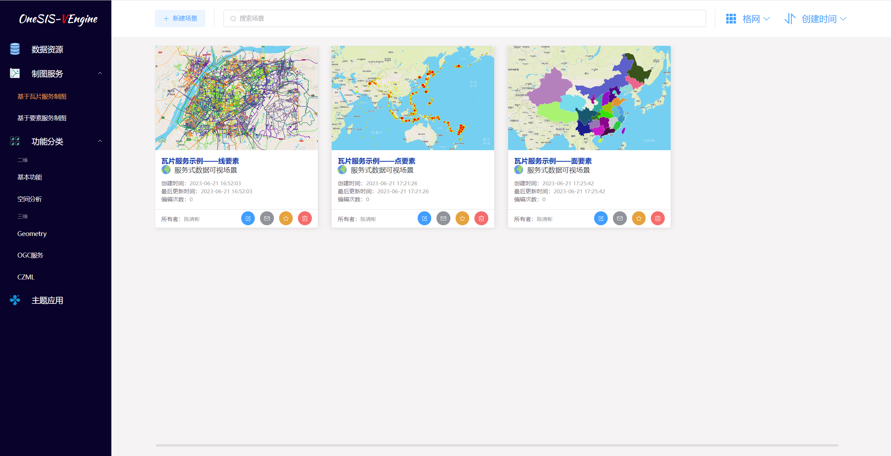
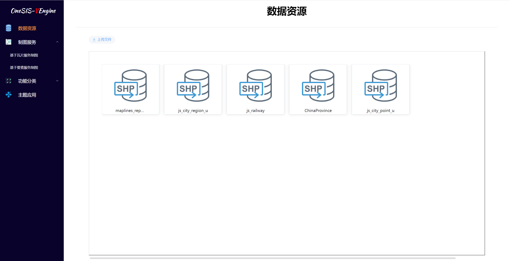
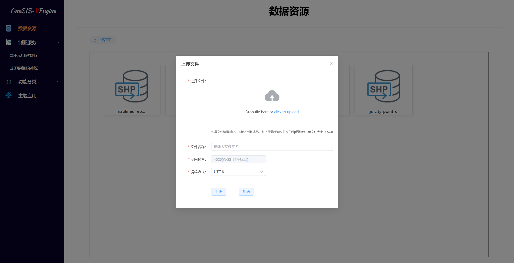

# OneSIS地图可视化引擎

## 项目介绍

可视化引擎实现了不同数据源（`PostGIS` / `MBTiles` / `GeoServer`）的接入，基于`Mapbox Style Specification`所定义的图层样式结构，通过多种可视化组件的定制和可视化模板的配置来实现多场景的数据可视化表达

## 项目介绍

服务端项目地址 👉 [MapServer](https://github.com/chance7bin/MapServer) 

## 关键技术

可视化引擎主要使用`Mapbox GL JS`的API，参考`Mapbox`的样式规范`Mapbox Style Specification`

详细配置请参考[mapbox官网](https://docs.mapbox.com/mapbox-gl-js/style-spec/layers/)

## 系统功能

#### 场景列表

#### 场景创建

#### 场景编辑

>通过可视化组件的定制和可视化模板的配置来实现多场景的数据可视化表达

#### 数据资源列表

#### 数据上传

>shapefile格式的压缩包导入pg中

